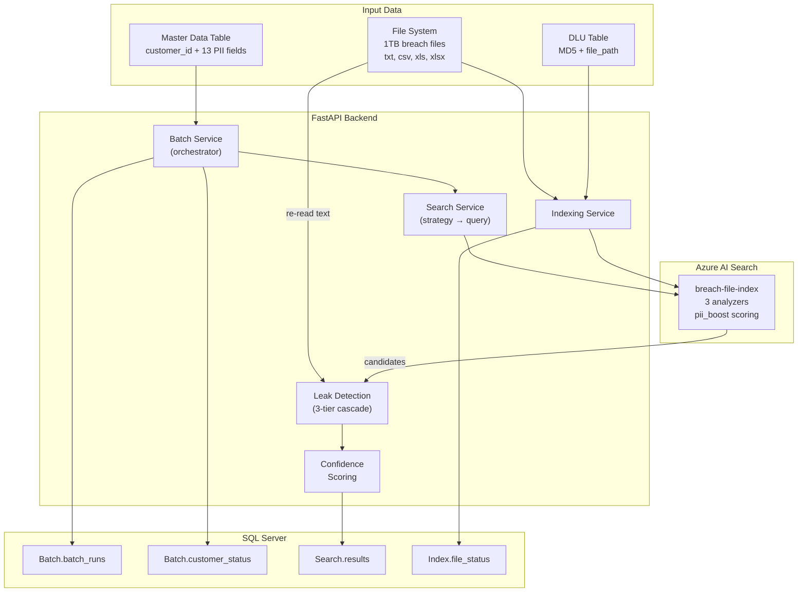
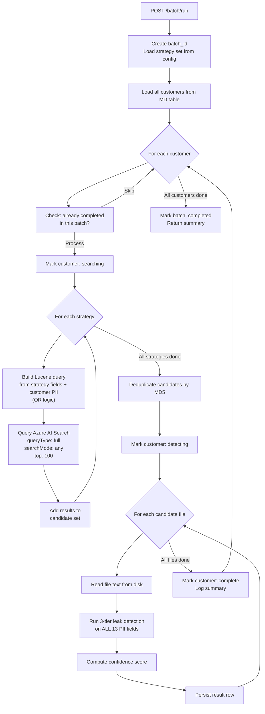

# Breach Data PII Search — V2 System Design Document

> **Status**: Draft — Under Discussion
> **Version**: 2.0
> **Last Updated**: 2026-03-11
> **Replaces**: V1 (single-customer on-demand search)

---

## Table of Contents

1. [Problem Statement](#1-problem-statement)
2. [First Principles Analysis](#2-first-principles-analysis)
3. [Solution Overview](#3-solution-overview)
4. [Input Data Sources](#4-input-data-sources)
5. [Three-Phase Pipeline](#5-three-phase-pipeline)
6. [Strategy System](#6-strategy-system)
7. [Azure AI Search — How It Works In Our System](#7-azure-ai-search--how-it-works-in-our-system)
8. [Leak Detection Engine](#8-leak-detection-engine)
9. [Confidence Scoring Model](#9-confidence-scoring-model)
10. [Batch Processing & Resumability](#10-batch-processing--resumability)
11. [Status Tracking & Observability](#11-status-tracking--observability)
12. [Results & Output](#12-results--output)
13. [API Endpoints](#13-api-endpoints)
14. [Data Model](#14-data-model)
15. [Project Structure](#15-project-structure)
16. [What Carries Over From V1](#16-what-carries-over-from-v1)
17. [What Changes From V1](#17-what-changes-from-v1)
18. [Architecture Diagrams](#18-architecture-diagrams)
19. [Key Decisions & Rationale](#19-key-decisions--rationale)
20. [Simulated Data (Development)](#20-simulated-data-development)
21. [Open Questions](#21-open-questions)

---

## 1. Problem Statement

### The Situation

A company has experienced a data breach. Files have been stolen or exposed — these files could be payroll records, HR onboarding forms, insurance claims, tax documents, client intake forms, or any other business document. The breach could involve **thousands of files totaling up to 1TB** of data.

The company also maintains a **master list of customers** with their known PII (Personally Identifiable Information): names, Social Security Numbers, dates of birth, driver's licenses, addresses, and more.

### The Core Question

> **"For each customer, what data of theirs was exposed, and in which files?"**

That's the single question this entire system exists to answer. Everything else — indexing, searching, fuzzy matching, confidence scoring — is engineering to answer that question accurately and at scale.

### Why This Is Hard

- **Unstructured vs. structured**: Breach files are unstructured text (documents, spreadsheets, CSVs). Customer PII is structured data. We need to match one against the other.
- **PII appears in many formats**: An SSN might appear as `343-43-4343`, `343434343`, or just the last four `4343`. A date of birth might be `1990-05-15`, `05/15/1990`, or `15.05.1990`.
- **Names are messy**: "John Smith" might appear as "J. Smith", "Smith, John", "Jon Smyth" (misspelled), or "Johnathan Smith" (formal variant).
- **Many-to-many relationship**: A single file can contain data for multiple customers. A single customer's data can appear across multiple files.
- **Scale**: At 1TB with potentially tens of thousands of files and hundreds of customers, brute-force approaches don't work.

### The Consequence of Getting It Wrong

If we **miss** a file that contains a customer's data, that customer doesn't get notified. This is a legal and compliance failure. **Accuracy is the top priority.**

---

## 2. First Principles Analysis

### The Naive Approach (And Why It Fails)

The brute-force answer: take every customer, open every file, check if their PII is in there.

```
200 customers × 30,000 files = 6,000,000 comparisons
Each comparison = regex matching + normalized matching + fuzzy matching across full file text
```

This is:
- **Slow**: Most comparisons find nothing
- **Wasteful**: 99% of files have nothing to do with a given customer
- **Unscalable**: Grows linearly with both customers AND files

### The Key Insight: Narrow First, Confirm Second

This is the same pattern used in every search system:

- **Google** doesn't scan every webpage for your query. It uses an inverted index to find candidates, then ranks them.
- **A detective** doesn't interrogate every person in the city. They narrow suspects first, then investigate deeply.
- **A doctor** doesn't run every possible test. They use symptoms to narrow down, then confirm with specific tests.

Applied to our problem:

| Step | What | Analogy |
|------|------|---------|
| **1. Index** | Make all files searchable | Building a library catalog |
| **2. Search** | Find candidate files per customer | Searching the catalog for relevant books |
| **3. Detect** | Confirm exactly what PII is in each file | Reading the actual book to find specific passages |

### Why This Works: The Math

```
30,000 files total (1TB)
200 customers

Search returns ~50 candidates per customer (on average)
Detection runs on: 200 × 50 = 10,000 pairs

vs. Brute force: 200 × 30,000 = 6,000,000 pairs

Search + Detect is ~600x less work than brute force.
```

The search engine (Azure AI Search) eliminates 99%+ of irrelevant files in milliseconds. Leak detection — the expensive, thorough step — only runs on the small set of candidates that actually matter.

---

## 3. Solution Overview

The system is a **three-phase pipeline** that processes breach files and customer records to produce a detailed report of what PII was leaked for each customer and in which files.

```
┌──────────────────────────────────────────────────────────┐
│                    THREE-PHASE PIPELINE                    │
│                                                            │
│   Phase 1: INDEX          Phase 2: SEARCH                  │
│   ┌───────────────┐       ┌───────────────────────────┐    │
│   │ Files → Azure  │       │ For each customer:         │    │
│   │ AI Search      │       │   Run strategy queries     │    │
│   │ (done once)    │       │   → candidate files        │    │
│   └───────────────┘       └───────────────────────────┘    │
│                                                            │
│   Phase 3: DETECT                                          │
│   ┌───────────────────────────────────────────────────┐    │
│   │ For each (customer, candidate file):               │    │
│   │   Three-tier detection → per-field results          │    │
│   │   Confidence scoring → overall score                │    │
│   │   Persist to results table                          │    │
│   └───────────────────────────────────────────────────┘    │
│                                                            │
│   Output: customer_id | md5 | leaked_fields | confidence   │
└──────────────────────────────────────────────────────────┘
```

### Processing Model

Search and detection run **together per customer** (not in separate bulk phases):

```
For each customer:
    Search (all strategies) → candidates
    Detect (all candidates) → results
    → Next customer
```

This is simpler, uses less memory, and allows per-customer status tracking.

---

## 4. Input Data Sources

### DLU Table (Data Lake Universe)

The file metadata table. Contains every breach file the system needs to process.

| Column | Type | Description |
|--------|------|-------------|
| `MD5` | VARCHAR (PK) | MD5 hash of the file — unique identifier |
| `file_path` | NVARCHAR | Path to the file on disk |

That's it. Intentionally simple. The file type (txt, csv, xls, xlsx) is inferred from the file path extension at runtime — no need to store it separately.

### MD Table (Master Data)

The customer PII table. Contains every customer whose data we need to check against breach files.

| Column | Type | Description |
|--------|------|-------------|
| `customer_id` | INT (PK) | Unique customer identifier |
| `Fullname` | NVARCHAR(250) | Full name as stored in system |
| `FirstName` | NVARCHAR(100) | First name |
| `LastName` | NVARCHAR(100) | Last name |
| `DOB` | DATE | Date of birth |
| `SSN` | VARCHAR(11) | Social Security Number (XXX-XX-XXXX) |
| `DriversLicense` | VARCHAR(50) | Driver's license number |
| `Address1` | NVARCHAR(250) | Primary address |
| `Address2` | NVARCHAR(250) | Secondary address |
| `Address3` | NVARCHAR(250) | Tertiary address |
| `ZipCode` | VARCHAR(10) | ZIP code |
| `City` | NVARCHAR(100) | City |
| `State` | VARCHAR(2) | State (2-char code) |
| `Country` | VARCHAR(50) | Country |

13 PII fields total. Any field can be NULL (not all customers have all data).

### Relationship

There is no direct foreign key between DLU and MD. The connection is discovered through search and detection — that's the whole point of this system.

---

## 5. Three-Phase Pipeline

### Phase 1: Indexing

**Purpose**: Make all breach files searchable by extracting their text and pushing it into Azure AI Search.

**When it runs**: Once, before any batch search. Can be re-run incrementally when new files arrive.

**Process**:
```
For each MD5 in DLU table:
    1. Check if already indexed → skip if yes (resumable)
    2. Resolve file path from DLU record
    3. Infer file type from extension (.txt, .csv, .xls, .xlsx)
    4. Extract text content:
       - .txt  → read as UTF-8
       - .csv  → csv module, concatenate all cells
       - .xlsx → openpyxl, all sheets, all cells
       - .xls  → xlrd, all sheets, all cells
    5. Build search document with the extracted text
    6. Push to Azure AI Search (batch upload, up to 1000 per batch)
    7. Log success/failure
```

**Error handling**:
- File not found → log error, count as failed, continue
- Unsupported extension → log warning, skip
- Corrupt file → log error, count as failed, continue
- Encoding error → log error, count as failed, continue
- Empty file → index with empty content (will produce no matches)
- The `extract_text()` function returns `str` on success, `None` on failure. Never raises exceptions.

**Output**: All files are searchable in Azure AI Search. Status tracked: total, indexed, failed, skipped.

### Phase 2: Batch Search

**Purpose**: For each customer, use configurable strategies to find candidate files that might contain their PII.

**When it runs**: Triggered by user (API call or script). Creates a new batch run with a unique batch ID.

**Process**:
```
For each customer in MD table:
    candidates = empty set

    For each strategy in strategy set:
        1. Build Lucene query from strategy fields + customer's PII values
        2. Query Azure AI Search (all 3 content fields, scoring profile, top 100)
        3. Add returned files to candidates set
        4. Log: "Customer X, strategy Y → N candidates"

    Union all candidates (deduplicate by MD5)
    → Pass to Phase 3 immediately
```

**Key detail**: Multiple strategies are run per customer, and their results are **unioned** (merged, deduplicated). A file only needs to be found by ONE strategy to become a candidate.

### Phase 3: Leak Detection

**Purpose**: For each candidate file found in Phase 2, confirm exactly which PII fields are present and with what confidence.

**When it runs**: Immediately after Phase 2, per customer (not as a separate bulk phase).

**Process**:
```
For each (customer, candidate file) pair:
    1. Read the actual file text from disk (not from Azure Search — may truncate)
    2. For ALL 13 PII fields (regardless of which strategy found the file):
       - Tier 1: Exact regex matching
       - Tier 2: Normalized string matching
       - Tier 3: Fuzzy matching (name fields only)
       - First match wins (cascade)
    3. Compute per-field confidence
    4. Compute overall file confidence (formula depends on which anchors matched)
    5. Persist result row to database
```

**Critical distinction**: The strategy determines how we SEARCH (which fields to query). But leak detection ALWAYS checks ALL 13 fields. The strategy casts the net; detection tells us everything that's in the catch.

---

## 6. Strategy System

### What Is a Strategy?

A strategy defines **which PII fields to use as search terms** when querying Azure AI Search. It controls how the "net" is cast in Phase 2.

### Why Multiple Strategies?

**Accuracy is the top priority.** A single strategy has blind spots:

| Strategy | What it catches | What it misses |
|----------|----------------|----------------|
| `fullname + ssn` | Files with name or SSN | Files with only DOB or address |
| `lastname + dob` | Files with last name or DOB | Files with only SSN |
| `ssn + drivers_license` | Files with hard identifiers | Files with only names |

By running **multiple complementary strategies** and unioning the results, we cover more ground:

```
Strategy 1 catches: [file_a, file_b, file_c]
Strategy 2 catches: [file_a, file_d]         ← file_d was missed by Strategy 1
Strategy 3 catches: [file_a, file_c, file_e]  ← file_e was missed by 1 and 2

Union: [file_a, file_b, file_c, file_d, file_e]  ← full coverage
```

### The Cost Is Negligible

Running 3 strategies per customer means 3 Azure Search API calls instead of 1. Azure Search handles this trivially. The bottleneck is leak detection, and even with a larger candidate set (say 60 files instead of 30), it's still 600x less work than brute force.

```
200 customers × 3 strategies = 600 API calls (fast, cheap)
200 customers × 60 candidates = 12,000 detection runs (manageable)
vs.
200 customers × 30,000 files = 6,000,000 detection runs (unusable)
```

### Default Strategy Set

Defined in a **config file**. User can modify without changing code.

```yaml
# strategies.yaml
strategies:
  - name: fullname_ssn
    description: "Primary search using full name and SSN"
    fields: [Fullname, SSN]

  - name: lastname_dob
    description: "Catches files with last name + date of birth (no SSN needed)"
    fields: [LastName, DOB]

  - name: unique_identifiers
    description: "Safety net — catches files with any hard identifier"
    fields: [SSN, DriversLicense]
```

### How a Strategy Becomes a Search Query

Each strategy's fields are combined with **OR logic** into a single Lucene query.

**Example**: Strategy `fullname_ssn` for customer John Smith (SSN: 343-43-4343)

```
Query: "John~1 Smith~1" OR "343-43-4343" OR "343434343"
```

The `~1` is Lucene fuzzy operator — allows 1 character edit distance for typos.

### OR vs AND — Why OR?

**AND** means the file must contain ALL strategy fields. If a file has John Smith's SSN but his name is misspelled as "Jon Smyth", the AND query says "I see the SSN but not 'John Smith'" → **file is not returned**. This is a miss.

**OR** means the file must contain ANY of the strategy fields. The same file with "Jon Smyth" and "343-43-4343" → "I see the SSN" → **file is returned**. Caught.

Since accuracy is our priority, OR is the right choice. We'd rather have more candidates (some irrelevant) than miss real ones. Leak detection in Phase 3 filters out false positives.

### OR Also Helps With Scoring

Azure AI Search scores files higher when **more terms match**. With an OR query:

- File with both name AND SSN → high score
- File with only SSN → medium score
- File with only a partial name match → lower score

This score feeds into our confidence calculation, so files with multiple matching fields naturally rank higher.

### Why Not One Giant OR With All 13 Fields?

You could theoretically search for ALL PII fields at once:

```
"John~1 Smith~1" OR "343-43-4343" OR "1990-05-15" OR "D1234567" OR "90210" OR "CA" OR ...
```

**Problem**: Short, common values like zip codes (`90210`) and state codes (`CA`) match thousands of irrelevant files. The candidate list explodes, and leak detection becomes the bottleneck.

Strategies let you group fields **intelligently** — strong identifiers together, weak ones paired with strong ones. This keeps the candidate list manageable while maintaining accuracy.

### Custom Strategy Override

Users can define their own strategy set by editing the config file:

```yaml
strategies:
  - name: custom_aggressive
    description: "Maximum recall search"
    fields: [Fullname, FirstName, LastName, SSN, DOB, DriversLicense]

  - name: custom_address
    description: "Address-focused search"
    fields: [LastName, Address1, ZipCode]
```

The system reads whatever strategies are in the config file. No code changes needed.

---

## 7. Azure AI Search — How It Works In Our System

### Role in the Pipeline

Azure AI Search is the **filtering layer**. It takes a text query and returns the most relevant documents (files) from the entire corpus. It reduces tens of thousands of files to a manageable set of candidates.

It does NOT do the final determination of what PII leaked — that's the leak detection engine's job. Azure Search finds *candidate files*; leak detection *confirms what's actually there*.

### Index Structure

The index is named `breach-file-index`. Each document in the index represents one file.

**Three content fields with different analyzers** (same text, analyzed differently):

| Field | Analyzer | Purpose |
|-------|----------|---------|
| `content` | `standard.lucene` | Exact keywords + Lucene fuzzy (~1, ~2) |
| `content_phonetic` | Custom `phonetic_analyzer` | Names that sound alike (Smith/Smyth) |
| `content_lowercase` | Custom `name_analyzer` | Accent/case-insensitive matching |

**Why three fields?** Azure AI Search only allows one analyzer per field. To get three matching strategies (exact, phonetic, accent-insensitive), we store the same text three times with different analyzers. This is a standard Azure AI Search pattern.

### Custom Analyzer Definitions

**`phonetic_analyzer`**:
- Standard tokenizer → lowercase filter → ASCII folding filter → Double Metaphone filter (`replace: false`)
- `replace: false` means the original token ("Smith") AND its phonetic code are both indexed. So searching for "Smith" still finds "Smith" exactly, but also finds "Smyth" via the phonetic code.

**`name_analyzer`**:
- Standard tokenizer → lowercase filter → ASCII folding filter
- Handles accented characters: `é` → `e`, `ñ` → `n`

### Scoring Profile

The `pii_boost` scoring profile assigns weights to each content field:

| Field | Weight | Rationale |
|-------|--------|-----------|
| `content` | 3.0 | Exact matches are most valuable |
| `content_lowercase` | 2.0 | Accent-insensitive matches are next |
| `content_phonetic` | 1.5 | Phonetic matches are useful but less precise |

Files matching on `content` (exact) are boosted higher than files matching only on phonetic.

### How a Query Executes

When the system queries Azure AI Search:

```
queryType:      "full"         → enables Lucene syntax (fuzzy ~1, OR, quotes)
searchMode:     "any"          → file matches if ANY term matches (maximize recall)
searchFields:   content, content_phonetic, content_lowercase  → search all 3 fields
scoringProfile: "pii_boost"    → apply field weights
top:            100            → return up to 100 candidates per query
```

**Example query flow**:

```
Input strategy: fullname_ssn
Customer: John Smith, SSN: 343-43-4343

1. System builds Lucene query:
   "John~1 Smith~1" OR "343-43-4343" OR "343434343"

2. Azure AI Search processes this against all 3 fields:
   - content field: looks for exact/fuzzy matches of "John", "Smith", "343-43-4343"
   - content_phonetic: looks for phonetic matches (catches "Jon", "Smyth")
   - content_lowercase: looks for case/accent-insensitive matches

3. Results are scored using pii_boost weights and returned sorted by relevance

4. System gets back: [(file_a, score=12.5), (file_b, score=8.3), (file_c, score=5.1), ...]
```

### No Chunking

Files are indexed as whole documents (one file = one search document). This works because:
- Simulated files are small (500–3000 chars)
- No risk of splitting PII across chunks (e.g., SSN cut in half)
- Simpler document-to-file mapping (1:1)
- For production with larger files, chunking can be added later

---

## 8. Leak Detection Engine

### Purpose

The leak detection engine is the **confirmation step**. After Azure AI Search identifies candidate files, the engine reads each file's actual text and determines exactly which PII fields are present and how closely they match.

### Why Not Just Use Azure Search Scores?

Azure Search scores tell you "this file is probably relevant to this customer." They don't tell you:
- **Which specific PII fields** matched (was it the SSN? the name? the DOB?)
- **How exactly** it matched (exact? misspelled? partial?)
- **Where in the file** the match is (snippet context)

The leak detection engine answers all three questions.

### Three-Tier Cascade

For each PII field, the engine tries three matching tiers in order. **First match wins** — if Tier 1 finds it, Tiers 2 and 3 are skipped for that field.

```
Tier 1: Exact Regex  ──→  confidence 1.0
   │ miss
   ▼
Tier 2: Normalized   ──→  confidence 0.95
   │ miss
   ▼
Tier 3: Fuzzy        ──→  confidence ratio/100  (name fields ONLY)
   │ miss
   ▼
Not found for this field
```

### Tier 1: Exact Regex Matching

Pattern-based matching with strict regular expressions. Used for structured PII that has predictable formats.

| Field | Patterns | Example |
|-------|----------|---------|
| **SSN** | `\b343-43-4343\b`, `\b343434343\b` | Dashed and undashed |
| **SSN last-4** | `\b4343\b` (word boundary) | Partial match, confidence 0.40 |
| **DOB** | `\b1990-05-15\b`, `\b05/15/1990\b`, `\b15.05.1990\b` | ISO, US, European formats |
| **ZipCode** | `\b90210\b` | Word boundary |
| **DriversLicense** | `\bD1234567\b` | Word boundary |
| **State** | `\bCA\b` | 2-char code with word boundary (Tier 1 ONLY — not in Tier 2 because "CA" is too common without boundaries) |

### Tier 2: Normalized String Matching

Lowercase + strip punctuation, then substring search. Used for fields where formatting varies but the content is recognizable.

| Field | Method | Example |
|-------|--------|---------|
| **Fullname** | Complete-string substring search (NOT token-by-token) | `"john smith" in text.lower()` |
| **FirstName** | Normalized substring | `"john" in text.lower()` |
| **LastName** | Normalized substring | `"smith" in text.lower()` |
| **City** | Normalized substring | `"los angeles" in text.lower()` |
| **Address1/2/3** | Normalized substring | `"123 main street" in text.lower()` |
| **Country** | Normalized substring | `"united states" in text.lower()` |

**Note**: State is NOT in Tier 2 — two-character codes like "CA", "IN", "OR" produce too many false positives without word boundaries.

**Note**: Fullname uses complete-string substring search. "john smith" must appear as a contiguous string. Reordered names ("Smith, John") do NOT match in Tier 2 — they fall through to Tier 3 fuzzy matching.

### Tier 3: Fuzzy Matching

Uses `rapidfuzz` library's `token_set_ratio` with a sliding window approach. **Only applies to name fields**: Fullname, FirstName, LastName.

All other fields (DOB, SSN, Address, etc.) stop at Tier 2. They either match exactly/normalized or they don't — fuzzy matching doesn't make sense for structured identifiers.

**How it works**:
1. Split file text into overlapping windows of `len(search_term) × 1.5` characters
2. Step size: `max(1, len(search_term) // 2)` (50% overlap between windows)
3. Compute `token_set_ratio(search_term, window)` for each window
4. If max ratio ≥ 75 → match found, confidence = ratio / 100

**Why `token_set_ratio`?** It handles reordered tokens naturally:
- `token_set_ratio("Karthik Chekuri", "Chekuri Karthik")` → high score
- `token_set_ratio("John Smith", "Jon Smyth")` → moderate score (catches typos)

### Null PII Field Handling

If a customer's PII field is NULL or empty (e.g., no DriversLicense on record):
- Skip detection for that field
- Report as "not found"
- **Exclude from OtherFields_avg denominator** in confidence scoring (so null fields don't dilute the score)

### Disambiguation Rule

Triggers ONLY when:
- FirstName matches in the file
- BUT Fullname was NOT found AND LastName was NOT found

This means only the first name appeared (e.g., "John" without "Smith"). This is ambiguous — many people share first names.

| Condition | Action |
|-----------|--------|
| FirstName matches + SSN found in same file | Confidence 0.70 (SSN confirms identity) |
| FirstName matches + NO SSN in file | Confidence 0.30–0.50 + `needs_review = true` |

### Snippet Extraction

For each match, extract ~100 characters of surrounding context:

```json
{
  "field": "SSN",
  "method": "exact_regex",
  "confidence": 1.0,
  "snippet": "...employee records show SSN 343-43-4343 was used for payroll processing in Q1..."
}
```

---

## 9. Confidence Scoring Model

### Per-Field Confidence

Each PII field gets its own confidence score (0.0 to 1.0) based on how it was matched:

| Match Type | Confidence | Example |
|------------|-----------|---------|
| Exact regex (Tier 1) | 1.0 | SSN `343-43-4343` found exactly |
| Normalized match (Tier 2) | 0.95 | Name found with different case/punctuation |
| Fuzzy match (Tier 3) | ratio/100 | `token_set_ratio` / 100 (e.g., 0.82) |
| SSN last-4 partial | 0.40 | Only last 4 digits found |
| Disambiguation (with SSN) | 0.70 | First name only, but SSN confirms |
| Disambiguation (no SSN) | 0.30–0.50 | First name only, no confirmation |

### Overall File Confidence

Computed per (customer, file) pair. The formula depends on which **anchor fields** (SSN, Name) were found:

**Name_conf** = `max(Fullname_conf, FirstName_conf, LastName_conf)`

**OtherFields_avg** = average confidence of non-anchor evaluable fields (DOB, DL, Address, City, etc.). Denominator = count of non-null fields only.

**SearchScore_norm** = Azure Search score for this file ÷ max score across all files in result set

| Scenario | Formula | Typical Range |
|----------|---------|---------------|
| **SSN + Name both match** | `0.40 × SSN_conf + 0.30 × Name_conf + 0.15 × OtherFields_avg + 0.15 × SearchScore_norm` | 0.85–1.0 |
| **SSN only** (no name in file) | `0.60 × SSN_conf + 0.15 × OtherFields_avg + 0.25 × SearchScore_norm` | 0.70–0.95 |
| **Name only** (no SSN in file) | `0.50 × Name_conf + 0.20 × OtherFields_avg + 0.30 × SearchScore_norm` | 0.30–0.85 |
| **No anchor** (neither SSN nor name) | `0.50 × OtherFields_avg + 0.50 × SearchScore_norm` | Variable, `needs_review = true` |

---

## 10. Batch Processing & Resumability

### Batch Identity

Every run creates a unique **batch_id** (UUID). All results, status records, and logs are tagged with this ID.

```
Batch: a1b2c3d4-...
  Started: 2026-03-11 10:00:00
  Strategy set: [fullname_ssn, lastname_dob, unique_identifiers]
  Total customers: 200
  Status: running
```

### Triggering a Batch

**Two methods** (same service layer, zero code duplication):

| Method | When to use |
|--------|-------------|
| `POST /batch/run` | Production — trigger from any tool, UI, or automation |
| `python run_batch.py` | Development — simple CLI for testing and debugging |

Both accept optional parameters (e.g., which strategy set to use).

### Re-running

Running a new batch **appends** results with a new batch_id. Previous results are preserved. You can compare results across different runs or strategy sets.

### Resumability

At 1TB scale, crashes happen. The system is designed to resume where it left off:

**Indexing**:
- Before indexing a file, check if its MD5 already exists in Azure AI Search
- Skip already-indexed files
- If interrupted at file 480/500, restart processes only files 481–500

**Batch Search + Detection**:
- After processing each customer, mark them as completed in the status table
- If batch crashes at customer 150:
  - Restart the same batch_id
  - Query status table: "which customers are already completed?"
  - **Retry failed customers** (e.g., customer 50 that failed due to timeout)
  - **Skip completed customers** (1–149 minus failures)
  - **Continue from where it stopped** (151 onward)
- Result: no duplicate work, no lost progress, failed items get another chance

---

## 11. Status Tracking & Observability

### Why It Matters

At 1TB and hundreds of customers, you need to know:
- Is the system still running or stuck?
- How far along are we?
- What failed and why?
- When will it finish?

### Two Levels of Tracking

**1. Phase-Level Summary** — Quick overview of the entire batch:

```json
{
  "batch_id": "a1b2c3d4-...",
  "status": "running",
  "started_at": "2026-03-11T10:00:00Z",
  "indexing": {
    "total": 500,
    "completed": 500,
    "failed": 3,
    "skipped": 0
  },
  "searching": {
    "total_customers": 200,
    "completed": 120,
    "failed": 1,
    "in_progress": 1,
    "pending": 78
  },
  "detection": {
    "total_pairs": 3600,
    "completed": 3200,
    "failed": 2
  }
}
```

**2. Customer-Level Detail** — Per-customer status:

```json
[
  {
    "customer_id": 1,
    "status": "complete",
    "candidates_found": 5,
    "leaks_confirmed": 3,
    "strategies_matched": ["fullname_ssn", "unique_identifiers"],
    "overall_max_confidence": 0.95,
    "processed_at": "2026-03-11T10:02:15Z"
  },
  {
    "customer_id": 2,
    "status": "complete",
    "candidates_found": 0,
    "leaks_confirmed": 0,
    "strategies_matched": [],
    "processed_at": "2026-03-11T10:02:18Z"
  },
  {
    "customer_id": 3,
    "status": "failed",
    "error": "Azure Search timeout after 30s",
    "processed_at": "2026-03-11T10:02:45Z"
  },
  {
    "customer_id": 4,
    "status": "pending"
  }
]
```

### Storage

All status data is stored in **database tables** and exposed via **API endpoints**. Both live logs (console output) and persistent status records.

---

## 12. Results & Output

### Results Table Structure

One row per **(batch, customer, file)** combination:

```
batch_id | customer_id | md5 | strategy_that_found_it |
leaked_fields (JSON) | match_details (JSON) | overall_confidence |
needs_review | searched_at
```

### Example Result Row

```json
{
  "batch_id": "a1b2c3d4-...",
  "customer_id": 42,
  "md5": "c8578af0e239aaeb7e4030b346430ac3",
  "strategy_that_found_it": "fullname_ssn",
  "leaked_fields": ["SSN", "Fullname", "DOB"],
  "match_details": {
    "SSN": {"found": true, "method": "exact_regex", "confidence": 1.0, "snippet": "...SSN 343-43-4343 was used for..."},
    "Fullname": {"found": true, "method": "normalized", "confidence": 0.95, "snippet": "...records for john smith indicate..."},
    "DOB": {"found": true, "method": "exact_regex", "confidence": 1.0, "snippet": "...date of birth: 05/15/1990..."},
    "FirstName": {"found": true, "method": "normalized", "confidence": 0.95, "snippet": "...john smith..."},
    "LastName": {"found": true, "method": "normalized", "confidence": 0.95, "snippet": "...john smith..."},
    "DriversLicense": {"found": false},
    "Address1": {"found": false},
    "ZipCode": {"found": false},
    "City": {"found": false},
    "State": {"found": false},
    "Country": {"found": false}
  },
  "overall_confidence": 0.92,
  "azure_search_score": 12.5,
  "needs_review": false,
  "searched_at": "2026-03-11T10:02:15Z"
}
```

### What the Results Tell You

For customer 42, the file `c857...ac3` contains their SSN (exact match), full name (case variation), and date of birth (exact match). Overall confidence is 0.92 (high). No manual review needed.

This is what you need to notify the customer: **"Your SSN, name, and date of birth were found in an exposed file."**

---

## 13. API Endpoints

### Indexing

| Method | Path | Description |
|--------|------|-------------|
| `POST` | `/index/all` | Index all files from DLU (resumable) |
| `POST` | `/index/{md5}` | Index a single file |

### Batch Operations

| Method | Path | Description |
|--------|------|-------------|
| `POST` | `/batch/run` | Start a new batch search+detection run |
| `GET` | `/batch/{id}/status` | Phase-level status summary |
| `GET` | `/batch/{id}/customers` | Per-customer status list |
| `GET` | `/batch/{id}/results` | Full results for a batch |
| `GET` | `/batches` | List all batch runs |

### Responses

All indexing and batch endpoints return structured JSON with progress counters and error lists. Status endpoints return the tracking data described in Section 11.

---

## 14. Data Model

### Tables

```sql
-- File metadata (input)
CREATE TABLE [DLU].[datalakeuniverse] (
    MD5       VARCHAR(32)   PRIMARY KEY,
    file_path NVARCHAR(500) NOT NULL
);

-- Customer PII (input)
CREATE TABLE [PII].[master_data] (
    customer_id     INT            PRIMARY KEY,
    Fullname        NVARCHAR(250),
    FirstName       NVARCHAR(100),
    LastName        NVARCHAR(100),
    DOB             DATE,
    SSN             VARCHAR(11),
    DriversLicense  VARCHAR(50),
    Address1        NVARCHAR(250),
    Address2        NVARCHAR(250),
    Address3        NVARCHAR(250),
    ZipCode         VARCHAR(10),
    City            NVARCHAR(100),
    State           VARCHAR(2),
    Country         VARCHAR(50)
);

-- Batch run metadata
CREATE TABLE [Batch].[batch_runs] (
    batch_id        UNIQUEIDENTIFIER PRIMARY KEY,
    strategy_set    NVARCHAR(MAX),    -- JSON: strategies used
    status          VARCHAR(20),      -- pending, running, completed, failed
    started_at      DATETIME2,
    completed_at    DATETIME2,
    total_customers INT,
    total_files     INT
);

-- Per-customer batch status
CREATE TABLE [Batch].[customer_status] (
    id              INT IDENTITY PRIMARY KEY,
    batch_id        UNIQUEIDENTIFIER FK → batch_runs,
    customer_id     INT FK → master_data,
    status          VARCHAR(20),     -- pending, searching, detecting, complete, failed
    candidates_found INT DEFAULT 0,
    leaks_confirmed  INT DEFAULT 0,
    error_message   NVARCHAR(MAX),
    processed_at    DATETIME2
);

-- Search/detection results (output)
CREATE TABLE [Search].[results] (
    id                  INT IDENTITY PRIMARY KEY,
    batch_id            UNIQUEIDENTIFIER FK → batch_runs,
    customer_id         INT FK → master_data,
    md5                 VARCHAR(32) FK → datalakeuniverse,
    strategy_name       VARCHAR(100),
    leaked_fields       NVARCHAR(MAX),   -- JSON array
    match_details       NVARCHAR(MAX),   -- JSON per-field details
    overall_confidence  FLOAT,
    azure_search_score  FLOAT,
    needs_review        BIT DEFAULT 0,
    searched_at         DATETIME2 DEFAULT GETDATE()
);

-- Indexing status
CREATE TABLE [Index].[file_status] (
    md5             VARCHAR(32) PRIMARY KEY FK → datalakeuniverse,
    status          VARCHAR(20),    -- indexed, failed, skipped
    indexed_at      DATETIME2,
    error_message   NVARCHAR(MAX)
);
```

---

## 15. Project Structure

```
breach-search/
├── strategies.yaml              # Configurable strategy definitions
├── .env                         # Environment variables
├── .env.example
├── requirements.txt
├── run_batch.py                 # CLI entry point for batch runs
├── app/
│   ├── main.py                  # FastAPI app + CORS + lifespan
│   ├── config.py                # pydantic-settings .env loader
│   ├── dependencies.py          # DI for DB session + Azure Search client
│   ├── models/
│   │   ├── database.py          # SQLAlchemy engine + session
│   │   ├── dlu.py               # DLU table ORM
│   │   ├── master_data.py       # Master data ORM
│   │   ├── batch.py             # Batch runs + customer status ORM
│   │   └── result.py            # Search results ORM
│   ├── schemas/
│   │   ├── batch.py             # Batch request/response models
│   │   └── pii.py               # PII field models
│   ├── services/
│   │   ├── indexing_service.py  # DLU → text extraction → Azure AI Search
│   │   ├── batch_service.py     # Batch orchestration (search + detect per customer)
│   │   ├── search_service.py    # Strategy → Lucene query → Azure Search
│   │   ├── leak_detection.py    # Three-tier per-field detection
│   │   └── text_extraction.py   # .txt/.csv/.xls/.xlsx → plain text
│   ├── routers/
│   │   ├── indexing.py          # POST /index/all, /index/{md5}
│   │   └── batch.py             # POST /batch/run, GET /batch/{id}/*
│   └── utils/
│       ├── fuzzy.py             # Sliding window fuzzy matching
│       ├── confidence.py        # Confidence score computation
│       └── strategy_loader.py   # Read + parse strategies.yaml
├── scripts/
│   ├── generate_simulated_data.py
│   ├── create_search_index.py
│   └── seed_database.py
├── data/
│   ├── simulated_files/
│   ├── TEXT/
│   └── seed/
└── tests/
```

---

## 16. What Carries Over From V1

These components remain the same in V2:

| Component | Details |
|-----------|---------|
| **Text extraction service** | Extract text from txt, csv, xls, xlsx — same logic |
| **Azure AI Search index** | Same 3-analyzer setup (standard, phonetic, name) + pii_boost scoring |
| **Three-tier leak detection** | Regex → Normalized → Fuzzy cascade — same engine |
| **Confidence scoring** | Same 4 formulas (SSN+Name, SSN-only, Name-only, No-anchor) |
| **Fuzzy matching utilities** | rapidfuzz sliding window — same approach |
| **SQLAlchemy + pyodbc** | Same database connectivity |
| **Index creation script** | Same Azure AI Search index schema |

---

## 17. What Changes From V1

| Aspect | V1 | V2 |
|--------|----|----|
| **Search mode** | On-demand, single customer (`POST /search`) | Automated batch, all customers |
| **Trigger** | Manual API call per customer | One batch run processes everyone |
| **DLU table** | GUID, TEXTPATH, fileName, fileExtension, caseName, isExclusion, MD5 | MD5 (PK), file_path only |
| **Customer table** | `master_pii` with SSN as lookup | `master_data` with customer_id as PK |
| **Strategy** | Hardcoded query building | Configurable via `strategies.yaml` |
| **Multiple strategies** | N/A | Run N strategies per customer, union results |
| **Status tracking** | None | Phase-level + customer-level tracking tables + API |
| **Resumability** | None | Skip completed, retry failed, continue from last |
| **Batch management** | None | Batch IDs, run history, per-customer status |
| **Results** | Per-customer, per-file, single search_run_id | Per-batch, per-customer, per-file, strategy tagged |

---

## 18. Architecture Diagrams

### System Architecture



### Batch Search Flow



---

## 19. Key Decisions & Rationale

| # | Decision | Rationale |
|---|----------|-----------|
| 1 | **OR logic for strategy queries** | Accuracy is top priority. OR catches files where only some fields match. AND would miss files with partial matches. |
| 2 | **Multiple strategies per customer** | No single strategy covers all cases. Three complementary strategies provide broad coverage with negligible cost overhead. |
| 3 | **SSN + DriversLicense as safety-net strategy** | These are unique identifiers — if they appear in a file, it's almost certainly relevant to that customer, even if the name is completely absent. |
| 4 | **Strategy defined in config file** | Easy to modify without code changes. Different cases may need different strategies. |
| 5 | **Search + Detect run together per customer** | Simpler, lower memory, enables per-customer status tracking. No need to store intermediate candidate lists. |
| 6 | **Leak detection checks all 13 fields regardless of strategy** | Strategy controls how we search (cast the net). Detection tells us everything that's in the catch. We want the full picture. |
| 7 | **Three-tier detection cascade** | Regex is fast and precise. Normalized catches formatting differences. Fuzzy catches misspellings. Cascade avoids redundant work (first match wins). |
| 8 | **Fuzzy only for name fields** | SSNs, DOBs, zip codes are structured — they either match or they don't. Fuzzy matching only makes sense for freeform text like names. |
| 9 | **Resumable indexing and batch processing** | At 1TB scale, crashes are inevitable. System must recover without re-doing completed work. |
| 10 | **Batch IDs with append-on-rerun** | Preserves history. Allows comparing results across different strategies or time periods. |
| 11 | **rapidfuzz over fuzzywuzzy** | MIT-licensed, 5–10x faster, same API. |
| 12 | **Three Azure AI Search content fields** | Azure requires one analyzer per field. Three fields = three analysis strategies (exact, phonetic, accent-insensitive) on the same text. |
| 13 | **searchMode: "any" in Azure Search** | Maximize recall. Precision comes from leak detection, not from the search query. |

---

## 20. Simulated Data (Development)

For development and testing, we generate fake data:

- **10 customers** with diverse names, SSNs, addresses, etc.
- **~25 breach files** across txt, xlsx, csv, xls formats
- Each file contains PII from 1–4 customers, embedded in realistic document context
- **Intentional variations**: name misspellings, SSN format changes, date format variations, reordered names, abbreviations
- Files written to both `data/simulated_files/` (human-readable names) and `data/TEXT/{md5[:3]}/` (MD5 path structure)
- Seed CSVs for DLU and Master Data tables

This simulated data validates the entire pipeline end-to-end before real data is introduced.

---

## 21. Open Questions

1. **Azure Search top N**: We currently use `top: 100` per strategy query. Is this sufficient? Should it be configurable?
2. **Confidence threshold**: Should results below a certain confidence be filtered out or always included?
3. **Concurrent processing**: Should customers be processed in parallel (e.g., 5 at a time) or strictly sequential?
4. **File deduplication**: Can the same file content appear under different MD5 hashes? Do we need content-based dedup?
5. **Incremental batches**: If new customers are added to MD after a batch completes, should we support "process only new customers" mode?
